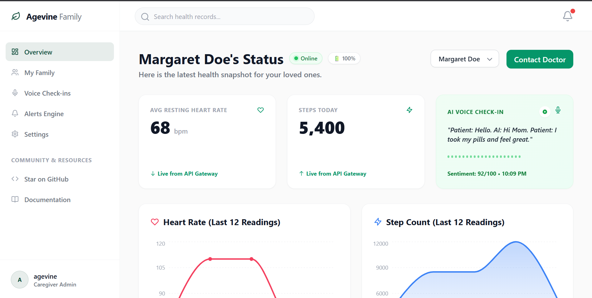
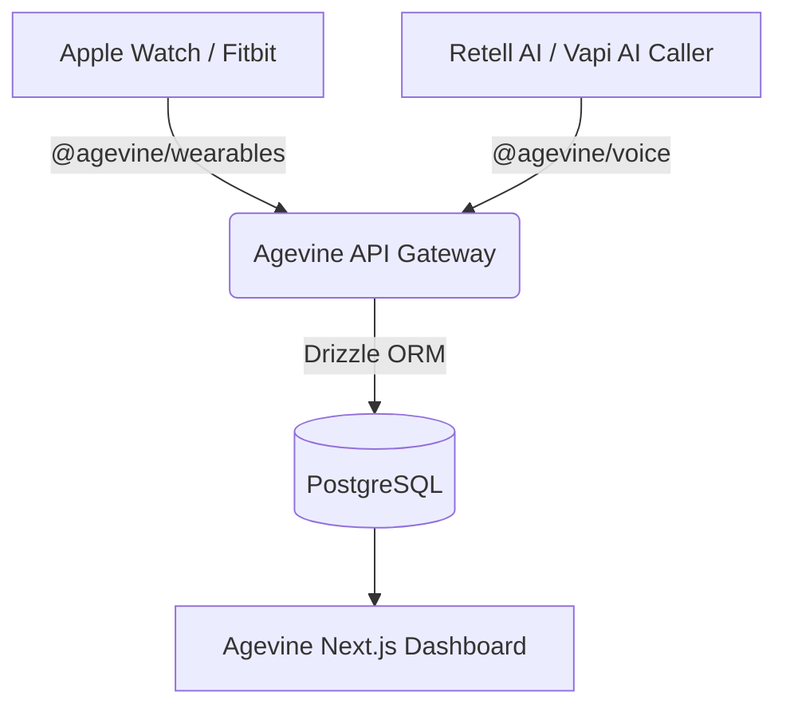

<div align="center">
  
  
  # Agevine (OSS)
  **The open-source operating system for eldercare AI.**

  [](https://www.gnu.org/licenses/agpl-3.0)
  [](https://www.npmjs.com/package/@agevine/voice)
  [](https://www.npmjs.com/package/@agevine/wearables)
</div>

<br />

<div align="center">
  
</div>

## The Core Platform
The core open-source platform is a monorepo that consists of:
- **`api-gateway`**: A central Express.js / TypeScript API that acts as the source of truth, funneling all data into Postgres using Drizzle ORM.
- **`ui-core`**: A fully responsive, modern Next.js + Tailwind CSS Family Dashboard to view your loved one's health data.
- **`packages/wearables`**: SDKs to connect Apple HealthKit, Garmin, and Fitbit streams.
- **`packages/voice`**: SDKs to connect Voice AI platforms (Retell, Vapi) and synthesize photorealistic speech (OpenAI TTS).

---

## ⚡ 1-Click Installation (Docker)

The absolute easiest way to get Agevine running on your own server (or locally) is using Docker Compose. It automatically spins up the PostgreSQL database, the Node.js API Gateway, and the Next.js Dashboard.

```bash
# Clone the repository
git clone https://github.com/agevine/agevine.git
cd agevine

# Boot up the entire stack
docker-compose up -d
```

That's it! 
- Your dashboard is now live at `http://localhost:3000`
- Your API Gateway is now live at `http://localhost:3001`

**Default Admin Password**: `agevine`

---

## 🏗️ Architecture

Agevine relies on a powerful "push" architecture. Instead of pulling from 10 different fragmented APIs, Agevine provides two simple NPM packages that you can drop into any app to push data directly into your self-hosted dashboard.



---

## 📦 The SDKs

Agevine comes with two MIT-licensed Node.js SDKs for integrating your devices.

### `@agevine/wearables`
Use this SDK in your companion apps to stream live IoT vitals. It includes OAuth adapters for Oura/Whoop and native Swift/Kotlin modules for direct Apple HealthKit integrations.
```typescript
import { AgevineClient } from '@agevine/wearables';

const client = new AgevineClient({ endpoint: 'http://localhost:3001' });

// REST Sync
await client.syncVitals({ patientId: 1, heartRate: 72, steps: 3500 });

// Real-Time WebSocket Streaming
client.startStream(1, () => client.streamData({ patientId: 1, heartRate: 75 }));
```

### `@agevine/voice`
Use this SDK in your AI Voice webhook handlers (like Retell AI or Bland AI).
```typescript
import { AgevineVoiceClient } from '@agevine/voice';

const client = new AgevineVoiceClient({ endpoint: 'http://localhost:3001' });
await client.logCall({ patientId: 1, sentimentScore: 85, summary: "Feeling well." });
```

---

## 📖 Documentation

For detailed guides on how to build custom hardware integrations or deploy Agevine to production on AWS/Render, check out our [Documentation Site](/docs).

## 📄 License
The Agevine core platform (Dashboard and API) is licensed under **AGPLv3**. 
The Agevine SDKs (`@agevine/voice` and `@agevine/wearables`) are licensed under **MIT** so you can safely integrate them into proprietary applications.
